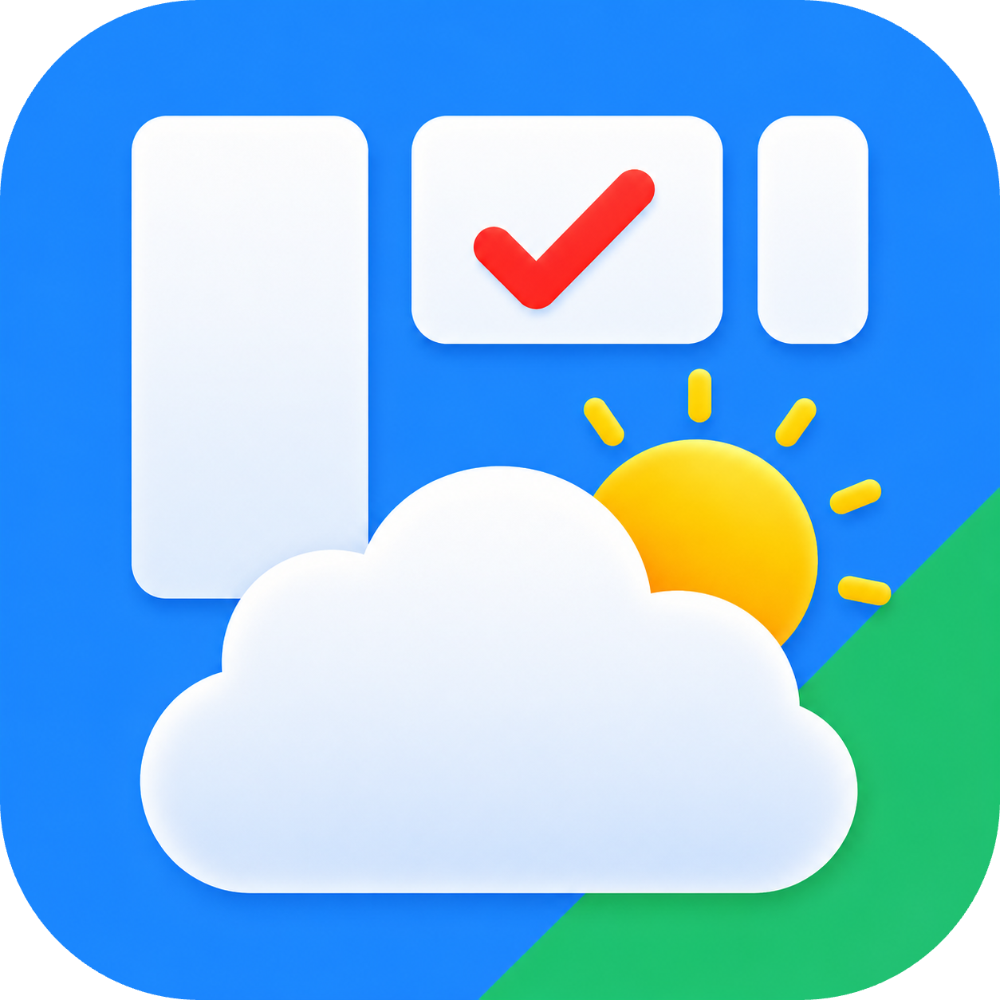
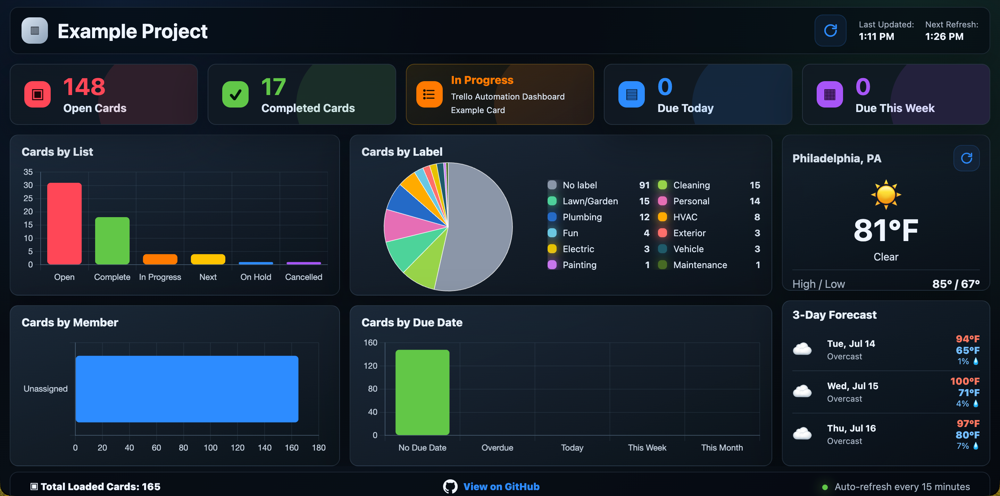

<!-- Begin README -->

<div align="center">
    <a href="https://github.com/scottgriv/trello-dashboard" target="_blank">
        
    </a>
</div>
<br>
<p align="center">
    <a href="https://www.javascript.com/"></a>
    <a href="https://www.w3schools.com/html/"></a>
    <a href="https://www.w3schools.com/css/)"></a>
    <br>
    <a href="https://github.com/scottgriv"></a>
    <a href="mailto:scott.grivner@gmail.com"></a>
    <a href="https://www.buymeacoffee.com/scottgriv"></a>
    <br>
    <a href="https://prgportfolio.com" target="_blank"></a>
</p>

---------------

<h1 align="center">📊 Trello Dashboard</img></h1>

Transform your Trello board into a self-hosted Mission Control dashboard with real-time analytics, project insights, weather, interactive charts, and a responsive experience across desktop, tablet, and mobile.

<div align="center">
    
    <br>
    <i>A simple yet powerful dashboard for managing your Trello projects.</i>
</div>
<br />

---------------

## Table of Contents

- [Features](#features)
- [Background Story](#background-story)
- [Getting Started](#getting-started)
- [Getting Your Trello API Credentials](#getting-your-trello-api-credentials)
    - [1. Create a Trello API Key](#1-create-a-trello-api-key)
    - [2. Generate a Trello Token](#2-generate-a-trello-token)
    - [3. Get Your Board ID](#3-get-your-board-id)
- [Security](#security)
- [Resources](#resources)
- [License](#license)
- [Credits](#credits)

## Features

- Real-time Trello board analytics and insights
- Interactive charts and visualizations
- Weather information for your location
- Responsive design for desktop, tablet, and mobile
- Easy configuration (boards and colors) through `config.js` and `colors.js`
- Self-hosted solution for privacy and control
- Manual refresh and auto-refresh options for data updates

## Background Story

I recently started using Trello to manage my personal home projects and tasks. I wanted a way to visualize my progress, track key metrics, and have a dashboard that could provide insights at a glance. This led me to create the **Trello Dashboard** project, which connects to your Trello board and displays relevant information in a clean and interactive interface. 

I wanted it to be light-weight and compatible with any hardware for hosting (specifically on my NAS on my home network) so it only uses JavaScript, HTML, and CSS to fetch data from the Trello API and present it in a user-friendly format. The dashboard includes features like real-time updates, weather information, and interactive charts to help you stay on top of your projects.

I've included two configuration files (`config.js` and `colors.js`) located in the [setup](./setup/) folder that allow you to customize the dashboard to your specific Trello board and preferences. The project is designed to be easy to set up and use, while also being flexible enough to accommodate different workflows and project management styles.

## Getting Started

1. Create a Trello account and set up your board with lists, cards, and labels.
2. Get your Trello API information (see below for instructions).
1. Open these two example files in a text editor:
    `setup/config_example.js`
    `setup/colors_example.js`
2. Rename them to:
    `config.js`
    `colors.js`
3. Update the values in `config.js` with your Trello board, refresh, and weather settings.
4. Update `colors.js` to match your Trello labels and lists.
5. Upload the full project folder to a local web server, NAS, or static hosting service.
6. Open the dashboard in your browser.

## Getting Your Trello API Credentials

The dashboard requires three values:

```js
TRELLO_KEY: "YOUR_TRELLO_API_KEY",
TRELLO_TOKEN: "YOUR_TRELLO_TOKEN",
BOARD_ID: "YOUR_BOARD_ID",
```

### 1. Create a Trello API Key

Visit:

https://developer.atlassian.com/cloud/trello/guides/rest-api/api-introduction/

or directly:

https://trello.com/power-ups/admin

Create a new Power-Up (or select an existing one), then navigate to the **API Key** section.

Copy your API key.

Example:

```js
TRELLO_KEY: "YOUR_TRELLO_API_KEY"
```

### 2. Generate a Trello Token

On the API Key page, click **Generate a Token**, or visit:

```
https://trello.com/1/authorize?expiration=never&scope=read&response_type=token&name=Trello%20Mission%20Control&key=YOUR_API_KEY
```

Replace `YOUR_API_KEY` with the API key you generated in Step 1.

Authorize the application.

Trello will display a token similar to:

```text
YOUR_TRELLO_TOKEN
```

Copy it into your configuration:

```js
TRELLO_TOKEN: "YOUR_TRELLO_TOKEN"
```

### 3. Get Your Board ID

Open the Trello board you want to display.

For a board URL like:

```
https://trello.com/b/AbCdEf12/my-awesome-project
```

the Board ID is:

```
AbCdEf12
```

Copy it into your configuration:

```js
BOARD_ID: "AbCdEf12"
```

## Security

⚠️ **Never commit your personal `config.js` file to GitHub.**

Your Trello token grants access to your Trello account based on the permissions you authorize.

Instead:

- Commit `config_example.js` (or `config.template.js`)
- Add `config.js` to your `.gitignore`
- Keep your real API key and token private
- Generate your own API key and token using the steps above

## Resources

- **Trello** – https://trello.com/
- **Trello REST API** – https://developer.atlassian.com/cloud/trello/rest/
- **Open-Meteo Weather API** – https://open-meteo.com/
- **Chart.js** – https://www.chartjs.org/
- **HTML5** – https://developer.mozilla.org/docs/Web/HTML
- **CSS3** – https://developer.mozilla.org/docs/Web/CSS
- **JavaScript (ES6+)** – https://developer.mozilla.org/docs/Web/JavaScript
- **Python 3** *(Optional local web server)* – https://www.python.org/

## License

This project is released under the terms of the **MIT License**, which permits use, modification, and distribution of the code, subject to the conditions outlined in the license.
- The [MIT License](https://choosealicense.com/licenses/mit/) provides certain freedoms while preserving rights of attribution to the original creators.
- For more details and to understand all requirements and conditions, see the [LICENSE](LICENSE) file in this repository.

## Credits

**Author:** [Scott Grivner](https://github.com/scottgriv) <br>
**Email:** [scott.grivner@gmail.com](mailto:scott.grivner@gmail.com) <br>
**Website:** [linktr.ee/scottgriv](https://www.linktr.ee/scottgriv) <br>
**Reference:** [Main Branch](https://github.com/scottgriv/trello-dashboard) <br>

---------------

<div align="center">
    <a href="https://github.com/scottgriv/trello-dashboard" target="_blank">
        
    </a>
</div>

<!-- End README -->
